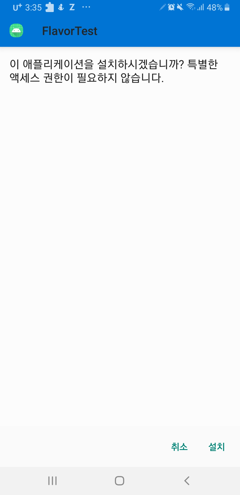
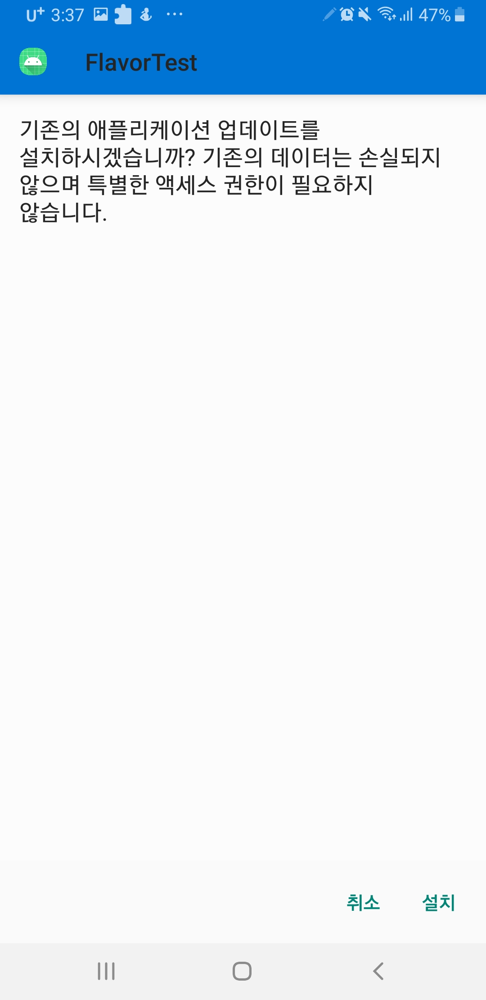
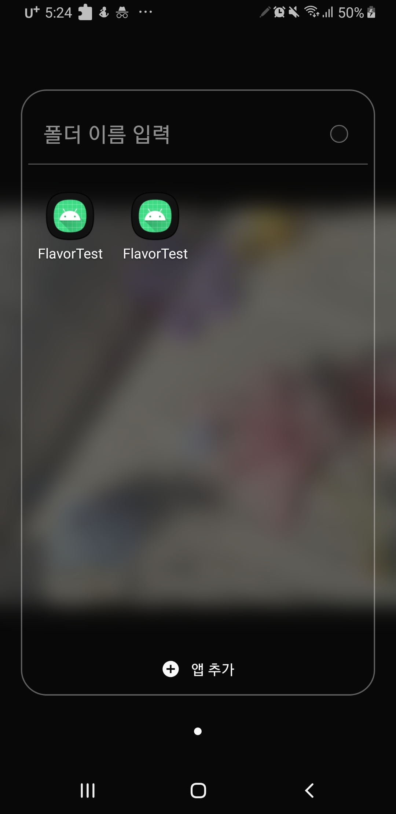
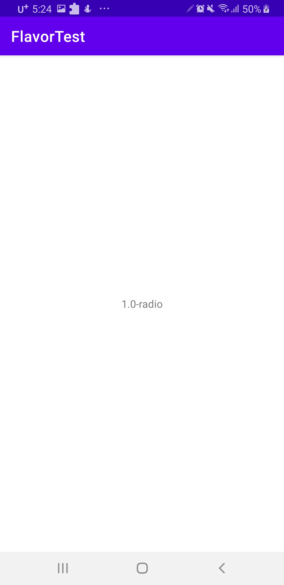

# Flavor 사용해서 같은 소스로 여러 개의 apk build 하기

## 요구사항
* 하나의 source로 여러 개의 apk 설치하기

## Android Application Id
> Every Android app has a unique application ID that looks like a Java package name, such as com.example.myapp. This ID uniquely identifies your app on the device and in Google Play Store.   
> [Android developers](https://developer.android.com/studio/build/application-id)

### Application Id 
* Developer 문서에 따르면 Android에서 각 app들은 **Application Id**라는 **고유한 값**을 가진다.   
* **고유값**이기 때문에 Google Play store에선 이 ID를 이용해서 **app을 식별**하며, 같은 application id는 같은 기기 내에 존재할 수 없다.
* play store에서 설치하지 않는다고 하더라도, Application Id가 같은 apk를 설치하려고 하면 system은 아래과 같이 물어본다.
 
* 첫 설치 시   
   

* 두 번째 설치 시도   


### Package Name
* [package name과 application id 차이점](http://tools.android.com/tech-docs/new-build-system/applicationid-vs-packagename)    
application id 는 package name 과 보기에 같아 보이지만, 둘은 독립적이다.   
이중에 app 을 식별하는데 쓰이는 것은 위에서 말한 바와 같이, application id이며 package id 는 R resource class 의 패키지 이름을 지정하는데 사용 된다.  

## Flavor
app 수준 build.gradle
```
    productFlavors {
        radio {
            dimension "mode"
            versionCode 101
            applicationIdSuffix ".radio"
            versionNameSuffix "-radio"
        }

        music {
            dimension "mode"
            versionCode 102
            applicationIdSuffix ".music"
            versionNameSuffix "-music"
        }

        video {
            dimension "mode"
            versionCode 103
            applicationIdSuffix ".video"
            versionNameSuffix "-video"
        }
    }
```
* code에서 package 이름에 따라 다른 설정을 해주는 것이 가능하다.
 


